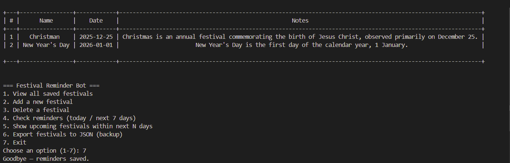

# Festival Reminder Bot

This is a Python-based console application that reminds you about upcoming festivals.  
It allows you to store festival names with their dates, view all saved festivals, and get reminders when a festival is today or coming soon.

##  About the Project

The Festival Reminder Bot is a small automation project made using Python.  
It helps users remember important festivals by showing reminders based on the current date.  
The project mainly focuses on date handling, dictionaries, conditionals, and automation basics in Python.

## Features

✅ Add new festivals with date and notes  
✅ View all saved festivals in a table format  
✅ Delete any festival you don’t need  
✅ Get reminders when:
- A festival is today
- A festival is within the next 7 days  
✅ Save and load festival data automatically using a JSON file  
✅ Optional desktop notification support (if `plyer` library is installed)

## Tools and Libraries Used

- Language:Python 3.6 or above  
- Editor: Visual Studio Code  
- Core Libraries:
  - `datetime` → for handling dates  
  - `json` → for saving and loading festival data  
  - `os` → for clearing console  
- Optional Libraries:
  - `prettytable` → to display data in a clean table  
  - `plyer` → for showing desktop notifications  

##  How to Run the Project

1. Clone or download this repository  
2. Open the project in VS Code
3. Make sure you have Python installed (`python --version`)  
4. Install helper libraries:
   ```bash
    pip install prettytable plyer
5. To Run the bot
    python festival_bot.py

## Data Storage
All festivals you add are automatically saved in a file called festivals.json
This means your data will stay safe even after you close the program.

## Concepts Used
-- Python dictionaries and lists
-- Functions for modular design
-- Date comparison using the datetime module
-- Conditional statements (if-else)
-- Loops (while, for)
-- File handling for saving data

## Output
## 🖥️ Output Example



When you run the bot, you will see a menu like this:


=== Festival Reminder Bot ===
1. View all saved festivals
2. Add a new festival
3. Delete a festival
4. Check reminders (today / next 7 days)
5. Show upcoming festivals within next N days
6. Export festivals to JSON (backup)
7. Exit
Choose an option (1-7):


